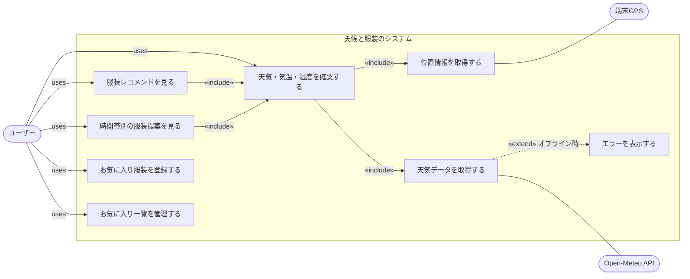
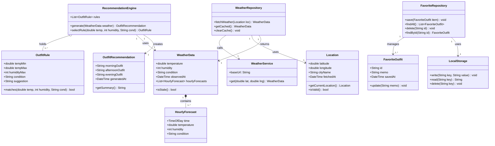
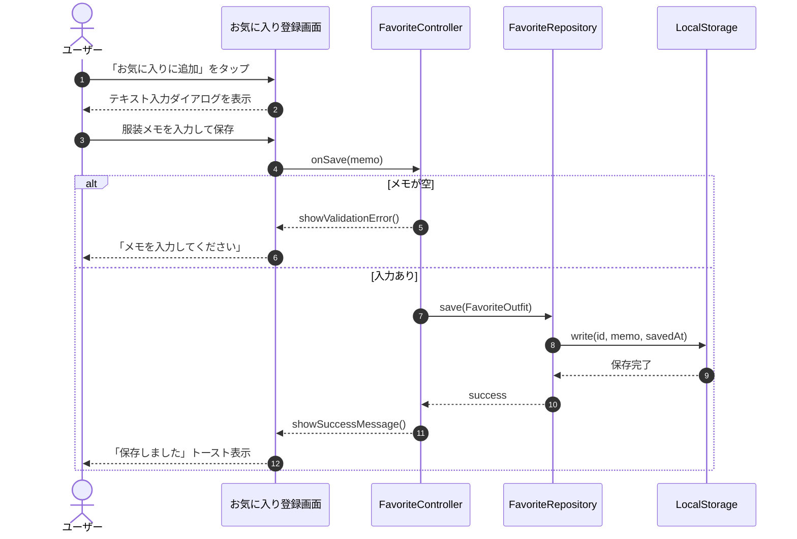
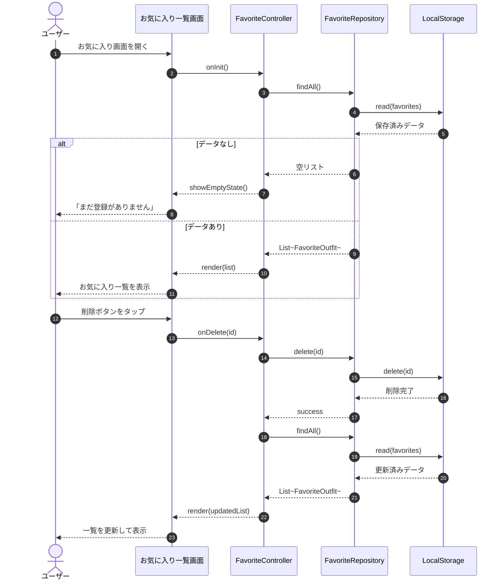
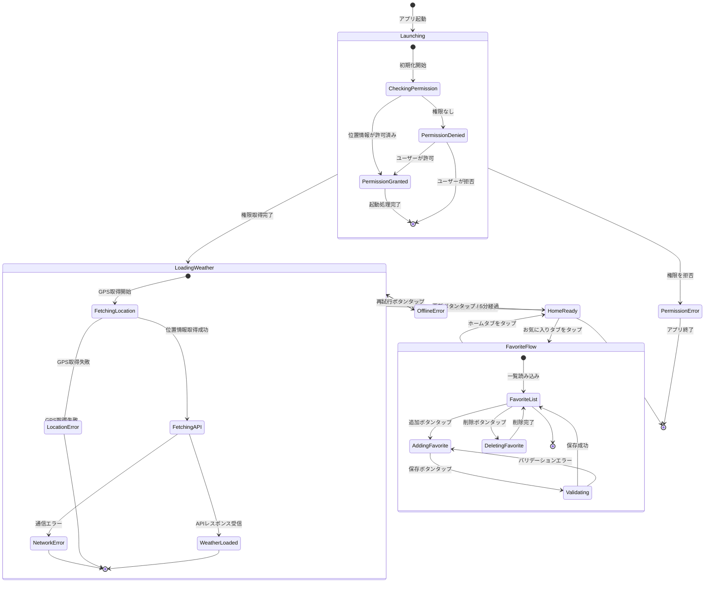
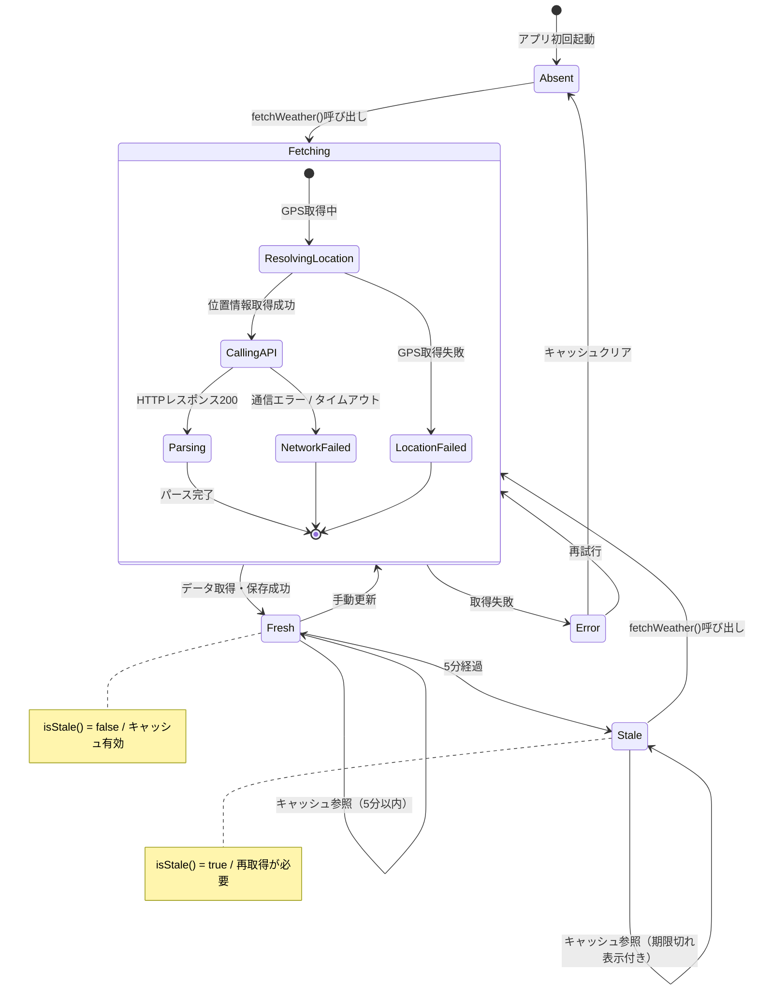
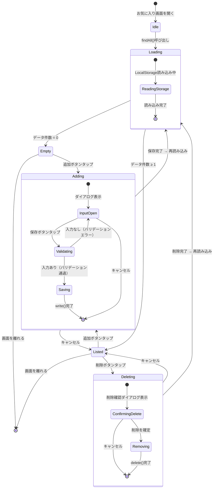

# 天候と服装のシステム

> 天気・気温・湿度をもとに、その日に適した服装を提案するFlutterモバイルアプリの要件定義ドキュメント

---

## 目次

1. [プロジェクト概要](#1-プロジェクト概要)
2. [技術スタック](#2-技術スタック)
3. [機能一覧](#3-機能一覧)
4. [機能要求・非機能要求](#4-機能要求非機能要求)
5. [ユースケース](#5-ユースケース)
6. [クラス設計](#6-クラス設計)
7. [シーケンス図](#7-シーケンス図)
8. [状態遷移図](#8-状態遷移図)
9. [使用プラットフォーム](#9-使用プラットフォーム)

---

## 1. プロジェクト概要

### アプリ名
天候と服装のシステム

### 目的
天気・気温・湿度をもとに、その日に適した服装をユーザーに提案するFlutterモバイルアプリを開発する。朝・昼・夜の時間帯別に提案を行い、ユーザーが気に入った服装をメモとして端末内に保存できる。

### 作らないもの（非目標）
- 服装のコーディネート画像表示・ブランド推薦
- 週間予報・降水確率の表示
- 手動での都市名検索・時間帯のカスタマイズ
- 複数デバイス間のデータ同期・クラウド保存
- ユーザー認証

---

## 2. 技術スタック

| 項目 | 内容 |
|------|------|
| フレームワーク | Flutter（Dart） |
| 対応プラットフォーム | iOS / Android |
| 天気データAPI | [Open-Meteo](https://open-meteo.com/)（APIキー不要・完全無料） |
| ローカル保存 | SharedPreferences または SQLite |
| バックエンド | なし（端末ローカルのみ） |

### Open-Meteo APIエンドポイント例

```
GET https://api.open-meteo.com/v1/forecast
  ?latitude={lat}
  &longitude={lng}
  &hourly=temperature_2m,relativehumidity_2m,weathercode
```

---

## 3. 機能一覧

### コア機能（優先度：高）

| 機能名 | 概要 |
|--------|------|
| 天気データ取得 | Open-Meteo APIから気温・湿度・天気状態を取得する |
| 服装レコメンド表示 | 気象データをルールベースで判定し服装を提案する |
| 時間帯別提案（朝・昼・夜） | 3時間予報から朝昼夜ごとに服装を提示する |

### サポート機能（優先度：中）

| 機能名 | 概要 |
|--------|------|
| お気に入り登録 | ユーザーが任意のテキストを服装メモとして保存する |
| お気に入り一覧・削除 | 保存済みメモを一覧表示し個別に削除できる |
| オフライン時エラー表示 | 通信不能時にユーザーへ明示的なエラーを表示する |
| ローカルデータ永続化 | SharedPreferences / SQLiteで端末保存する |

### 共通機能

| 機能名 | 優先度 | 概要 |
|--------|--------|------|
| 位置情報取得（GPS） | 高 | 現在地の緯度・経度を端末から取得する |
| ナビゲーション | 中 | 画面間の遷移（BottomNav等） |
| ローディング表示 | 低 | API通信中のスピナー・スケルトン |
| アプリアイコン・スプラッシュ | 低 | ストア申請・初回起動時の表示 |

---

## 4. 機能要求・非機能要求

### 機能要求

システムが「何をするか」を定義する。

| 機能名 | 内容 | 分類 |
|--------|------|------|
| 天気データ取得 | Open-Meteo APIから気温・湿度・天気状態を取得する | コア |
| 位置情報取得 | 端末GPSから現在地の緯度・経度を取得する | コア |
| 服装レコメンド表示 | 気象データをルールベースで判定し服装を提案する | コア |
| 時間帯別提案 | 朝・昼・夜それぞれに異なる服装提案を表示する | コア |
| お気に入り登録 | ユーザーが任意のテキストを服装メモとして保存する | サポート |
| お気に入り一覧・削除 | 保存済みメモを一覧表示し個別に削除できる | サポート |
| オフライン時エラー表示 | 通信不能時にユーザーへ明示的なエラーを表示する | サポート |

### 非機能要求

システムが「どのように動くか」を定義する。

#### 性能

| 要求 | 基準・根拠 |
|------|-----------|
| アプリ起動から天気表示まで3秒以内 | Open-Meteo応答速度 + GPS取得の合計を考慮 |
| お気に入りの読み込みは即時（500ms以内） | ローカル保存のためAPI待ちなし |

#### セキュリティ

| 要求 | 基準・根拠 |
|------|-----------|
| 位置情報は端末外へ送信しない | Open-Meteoへの送信は緯度経度のみ・匿名 |
| お気に入りデータは端末ローカルにのみ保存 | クラウド送信・外部共有なし |
| 位置情報取得は初回起動時に許可を明示的に求める | iOS/Android OSの権限モデルに準拠 |

#### ユーザビリティ

| 要求 | 基準・根拠 |
|------|-----------|
| 主要操作は3タップ以内で完結する | 起動→天気確認、起動→お気に入り登録の両導線 |
| エラー・ローディング状態を必ず画面上に示す | 通信中スピナー、オフライン時メッセージ表示 |
| iOS・Android両プラットフォームで同一UXを提供 | FlutterのクロスプラットフォームUIを活用 |

#### 保守性

| 要求 | 基準・根拠 |
|------|-----------|
| 服装提案ロジックを独立したファイルに分離する | ルール変更時にUI側を触らなくてよい構造 |
| APIのエンドポイントや閾値は定数として一元管理 | 変更箇所を1ファイルに集約し修正コストを下げる |
| FlutterのWidget単位でコンポーネントを分割する | 再利用性と可読性の確保。テスト容易性にも寄与 |

---

## 5. ユースケース

アクターは3つ定義している。「ユーザー」が主アクター、「端末GPS」と「Open-Meteo API」が外部システムとしての副アクターとなる。



### 矢印の読み方

- **実線 `«include»`** — 必ず呼び出される関係（服装提案は必ず天気確認を内包）
- **点線 `«extend»`** — 条件付きで発生する関係（オフライン時のみエラー表示が起動）

---

## 6. クラス設計



### 関連の種類

| 記法 | 種類 | 説明 |
|------|------|------|
| `*--` | コンポジション | WeatherDataが消えるとHourlyForecastも消える強い所有 |
| `o--` | 集約 | OutfitRuleはEngineとは独立して差し替え可能 |
| `-->` | 依存 | 「使う」関係。実装を差し替えても影響が少ない |

---

## 7. シーケンス図

### UC1：天気取得・服装提案

```mermaid
sequenceDiagram
  autonumber
  actor User as ユーザー
  participant UI as ホーム画面
  participant Ctrl as WeatherController
  participant Repo as WeatherRepository
  participant API as Open-Meteo API
  participant Eng as RecommendationEngine

  User->>UI: アプリ起動
  UI->>Ctrl: onInit()
  Ctrl->>Repo: getCurrentLocation()
  alt 位置情報の権限なし
    Repo-->>Ctrl: PermissionDeniedError
    Ctrl-->>UI: showPermissionDialog()
    UI-->>User: 位置情報の許可を求める
    User->>UI: 許可する
    UI->>Ctrl: retryWithPermission()
  end
  Repo-->>Ctrl: Location
  alt キャッシュが有効（5分以内）
    Ctrl->>Repo: getCached()
    Repo-->>Ctrl: WeatherData
  else キャッシュなし or 期限切れ
    Ctrl->>Repo: fetchWeather(Location)
    Repo->>API: GET /forecast?lat&lng&hourly
    alt ネットワークエラー
      API-->>Repo: NetworkError
      Repo-->>Ctrl: OfflineError
      Ctrl-->>UI: showOfflineError()
      UI-->>User: オフラインエラー表示
    else 取得成功
      API-->>Repo: JSON（3時間ごと予報）
      Repo-->>Ctrl: WeatherData
    end
  end
  Ctrl->>Eng: generate(WeatherData)
  loop 朝・昼・夜の各時間帯
    Eng->>Eng: selectRule(temp, humidity, condition)
  end
  Eng-->>Ctrl: OutfitRecommendation
  Ctrl-->>UI: render(WeatherData, OutfitRecommendation)
  UI-->>User: 天気＋時間帯別服装を表示
```



### UC4：お気に入り登録



### UC5：お気に入り管理



---

## 8. 状態遷移図

### アプリ全体



### 天気データ（WeatherData）



### お気に入り（FavoriteOutfit）



---

## 9. 使用プラットフォーム

本ドキュメントの要件定義作業はすべて以下のツールのみで完結した。

| ツール | 用途 |
|--------|------|
| [Claude（claude.ai）](https://claude.ai) | ヒアリング・要件整理・全図の生成 |
| [Mermaid.js](https://mermaid.js.org/) | ユースケース図・クラス図・シーケンス図・状態遷移図のレンダリング |

外部ツールへのアクセスやファイルエクスポートは一切行っておらず、すべてブラウザ内で完結している。

---

*このドキュメントはClaude（claude.ai）を使用して生成された要件定義ドキュメントです。*
